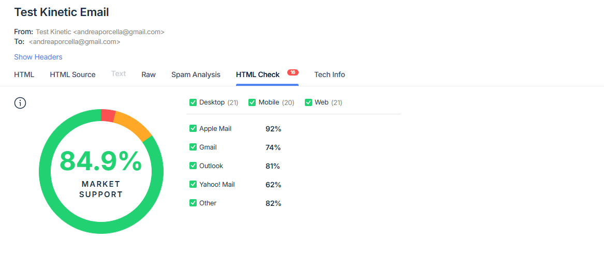

# Demo d'email kinetique

Exemple d'email interactif (flip 3D) avec fallback statique pour les clients qui ne supportent pas le CSS avance. Le CSS est injecte puis inline via un script de build.

## Rapport de compatibilite


## Prerequis
- Node.js 16+ (recommande) et npm
- (Optionnel) Identifiants SMTP de test pour `index.js` (ex: Mailtrap)

## Installation
```bash
npm install
```

## Developpement local
Servir l'HTML source avec un petit serveur statique :
```bash
npm run dev
```
Ouvre live-server sur le dossier `src/`.

## Build de l'email
Genere l'HTML final avec CSS inline dans `dist/index.html` :
```bash
npm run build
```
Le script `build-email.js` lit `src/index.html`, insere `src/styles.css` dans le `<style>` et utilise `inline-css` pour inliner en gardant le CSS necessaire au flip.

## Envoi de test
`index.js` envoie l'HTML genere via Nodemailer :
```bash
node index.js
```
Configure host/port/user/pass selon ton fournisseur (exemple Mailtrap inclus dans le repo).

## Structure
- `src/index.html` : markup email avec fallback statique et version kinetique basee sur checkbox/hover.
- `src/styles.css` : styles de base + regles 3D dans `@supports` pour eviter de masquer le fallback sur les clients non compatibles.
- `build-email.js` : pipeline d'inlining et sortie dans `dist/index.html`.
- `index.js` : exemple d'envoi avec Nodemailer.

## Compatibilite
- Les clients qui supportent `position:absolute`, `transform-style: preserve-3d` et `backface-visibility` voient le flip anime.
- Les autres voient le bloc fallback grace a `@supports`, evitant les soucis connus sur Outlook, Yahoo, Orange, SFR, etc.
- Utilise des images/SVG de couverture optimises et des liens absolus (pas d'assets locaux) pour l'envoi reel.

## Notes
- Conserve les styles critiques inline pour une compatibilite email maximale.
- Teste toujours sur les clients cibles (Apple Mail, iOS Mail, Gmail web/app, Outlook varies) avant d'envoyer des campagnes.

## Rapport de compatibilite

